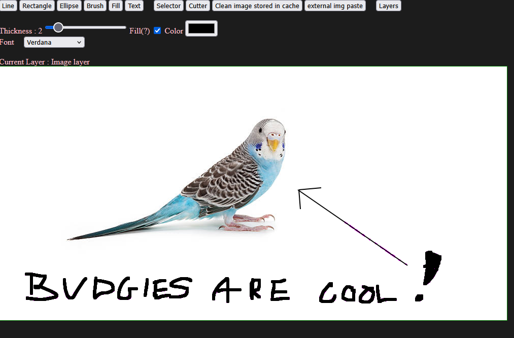
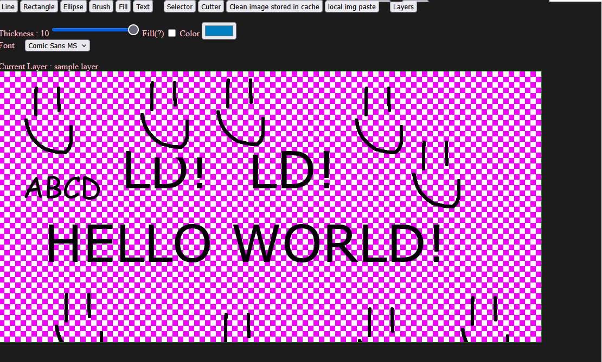

# pain-t

A browser-based raster image editor built with **Svelte**, **TypeScript**, and **Vite**. It implements a layered drawing pipeline on the HTML5 Canvas API — multiple drawing tools, layer compositing, selection/copy-paste, and undo — entirely client-side with no backend.

## Demos

<!-- TODO: replace the placeholders below with real GIFs/screenshots (e.g. docs/demo-*.gif) -->

| | |
| --- | --- |
|  |  |
## Features

- **Drawing tools** — brush, line, rectangle, ellipse, flood fill (bucket), and text
- **Layers** — add, reorder, rename, delete, and switch between layers, each composited onto the final canvas
- **Selection & clipboard** — select a region to cut or copy, and paste images either from a local selection or from the system clipboard (external paste supported)
- **Undo** — step back through the operation history per layer
- **Export** — save the current canvas as a PNG
- **Constrained drawing** — hold `Shift` for 1:1 proportions (square, circle) or axis-aligned lines

## Tech highlights

- Tool behavior is decoupled via an **operation/handler architecture**: each tool is a `Handler` that produces serializable `Operation` objects, which a `Painter` replays onto a canvas. This makes undo and per-layer regeneration straightforward.
- A **buffer canvas** isolates the in-progress operation from committed pixels, so live previews never corrupt the underlying layer.
- Layers are composited each animation frame, blending only into transparent regions of the target.

## Getting started

```bash
npm install
npm run dev
```

The app is served at `http://localhost:5173` by default.

### Scripts

| Command | Description |
| --- | --- |
| `npm run dev` | Start the Vite dev server |
| `npm run build` | Produce a production build |
| `npm run preview` | Preview the production build locally |
| `npm run check` | Type-check the project with `svelte-check` |

## Keyboard shortcuts

| Shortcut | Action |
| --- | --- |
| `Ctrl + S` | Save the canvas as a PNG file |
| `Ctrl + Z` | Undo the last action |
| `Ctrl + C` | Copy the current selection |
| `Ctrl + V` | Paste the copied image |
| `Ctrl + ↑ / ↓` | Switch between layers |
| `Shift` (while drawing) | Constrain to 1:1 proportions or axis-aligned lines |
